# Filmoteka

## Экран логина/регистрации

    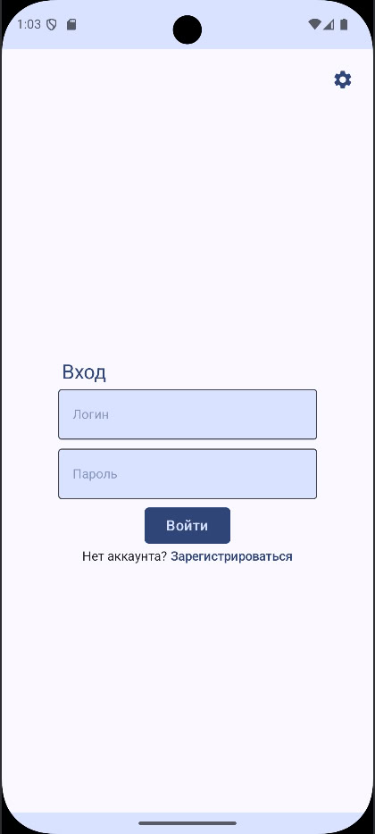
    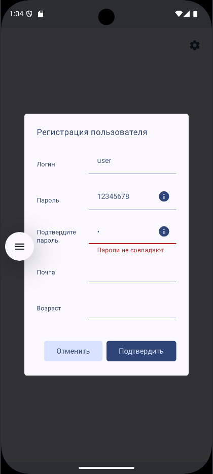

    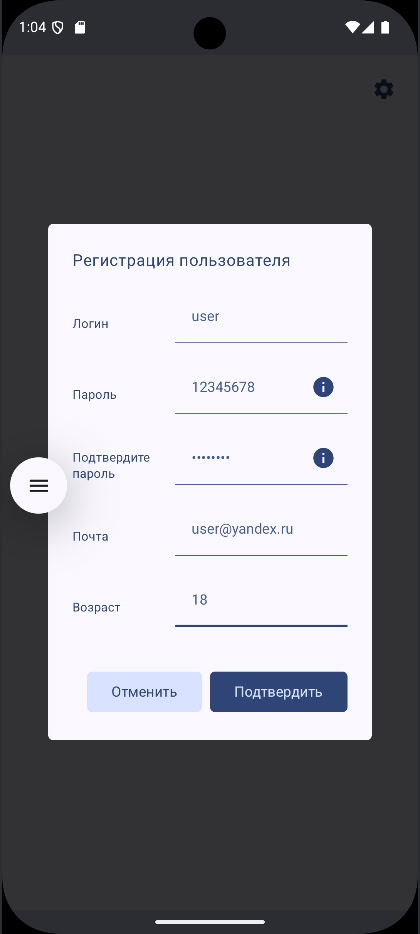
    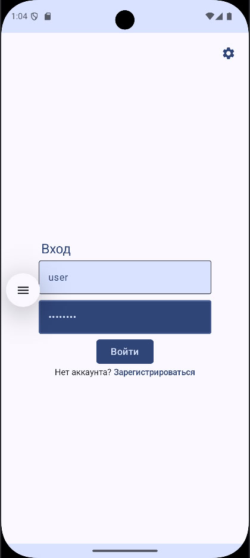

## Экран "Главное"

    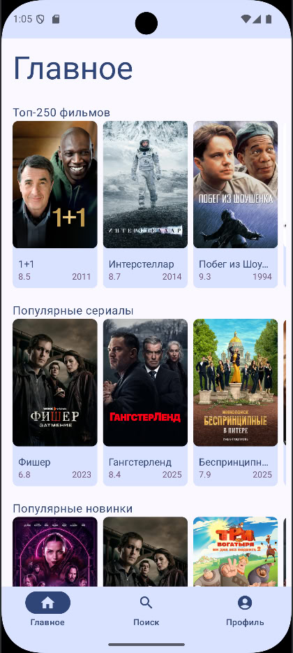

## Экран "Поиск"

    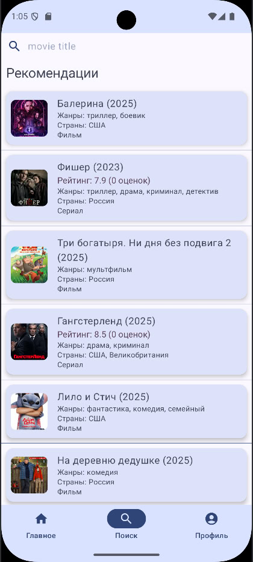

## Экран "Поиск"

    
    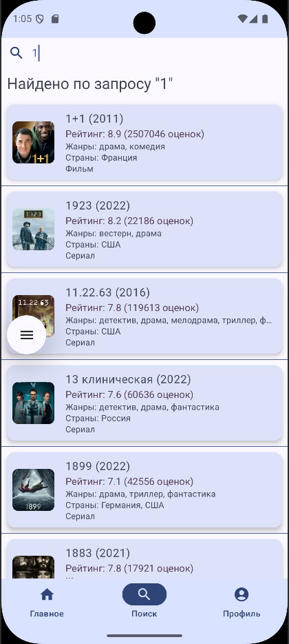

## Экран "Профиль"

    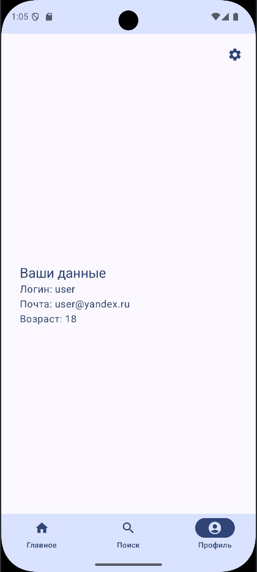

## Экран фильма

    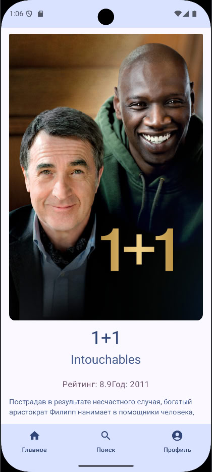

## Диалог настроек

    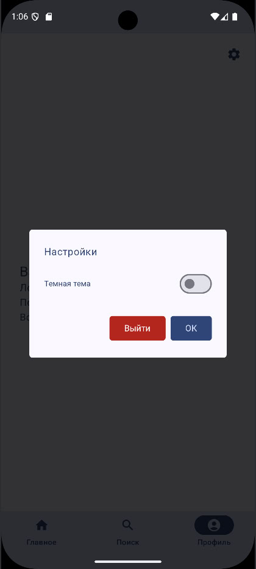

## Отображение с темной темой

    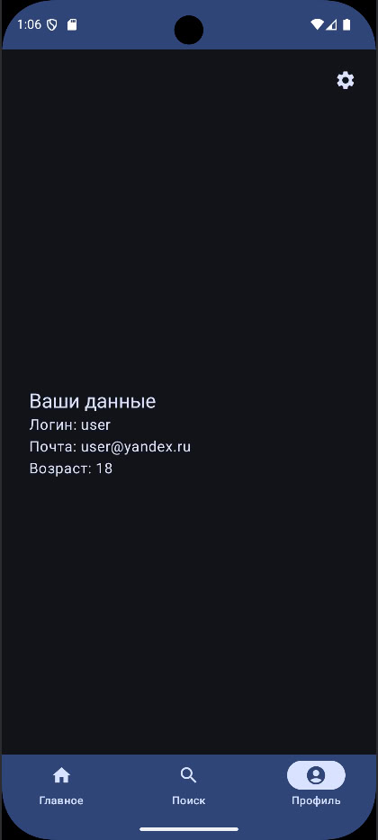
    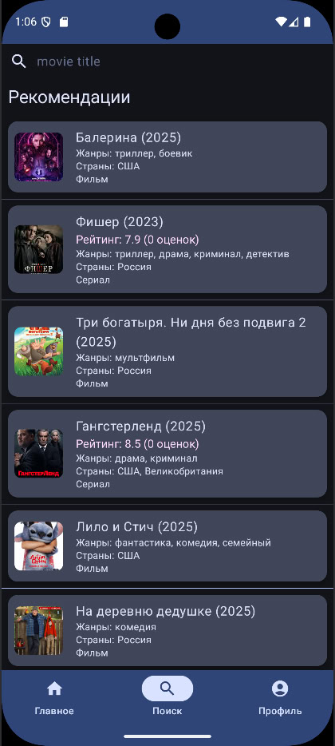
    
    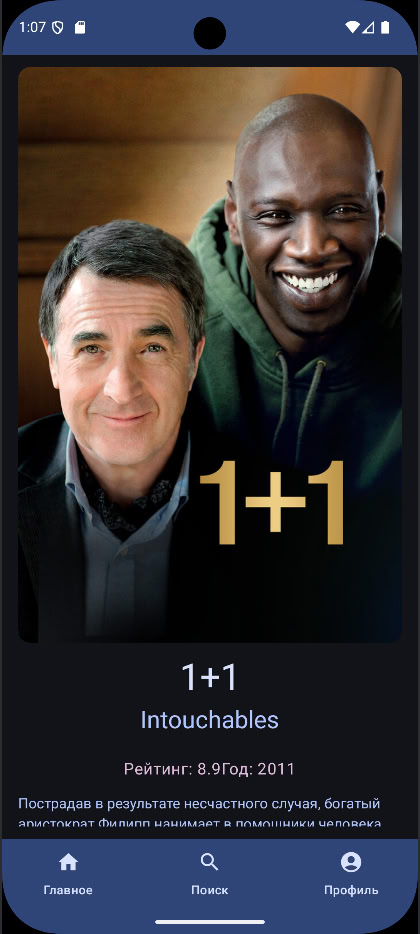
    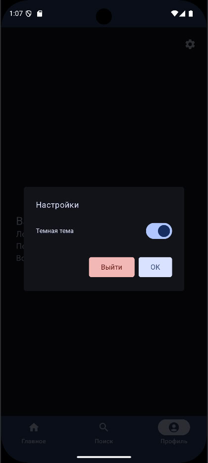

## Выход из профиля

    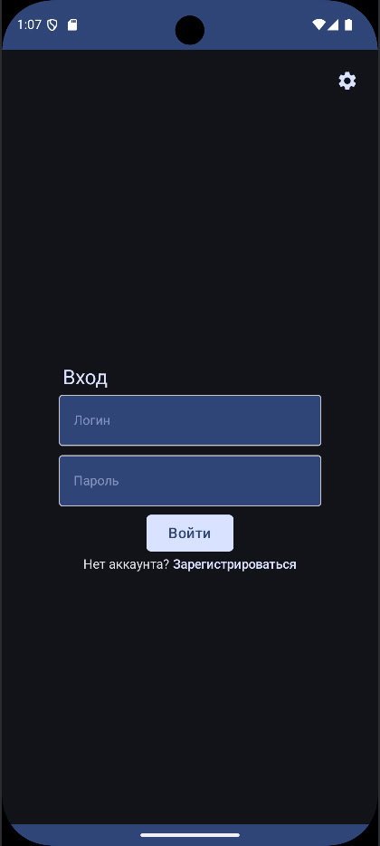

# Stack

- Kotlin Multiplatform
- Clean Architecture
- Multi Module
- MVI
- KTOR
- Compose
- Coroutines
- Flow
